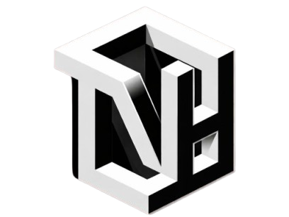
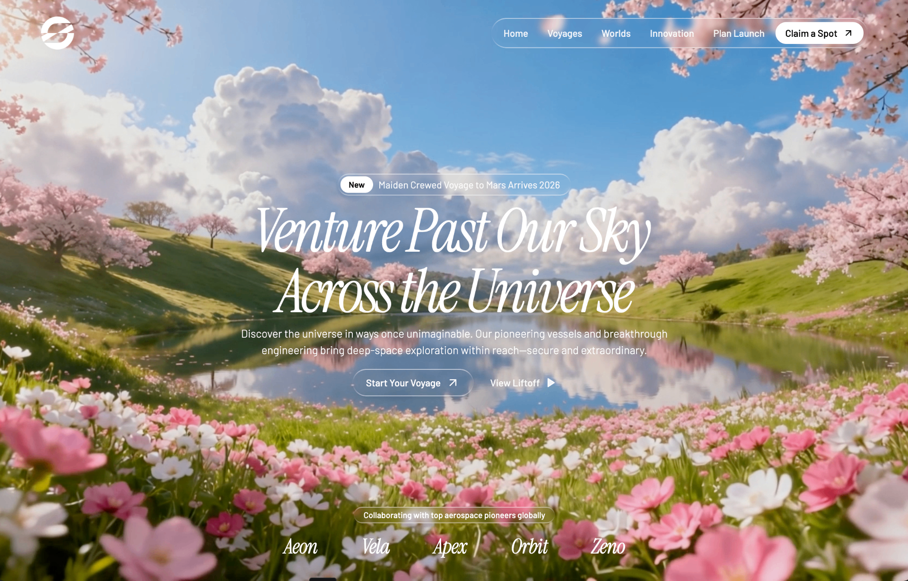
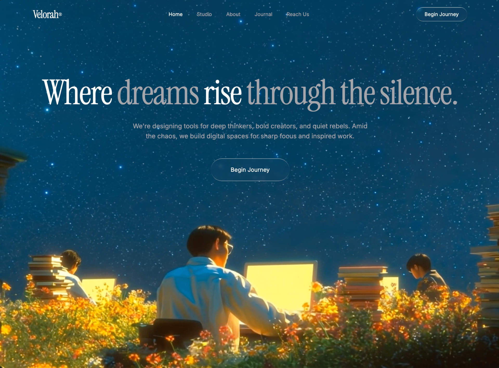
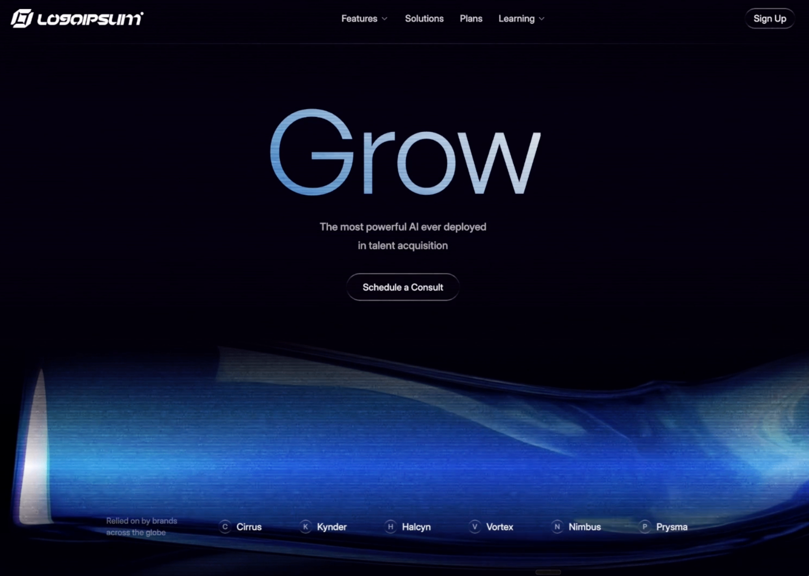
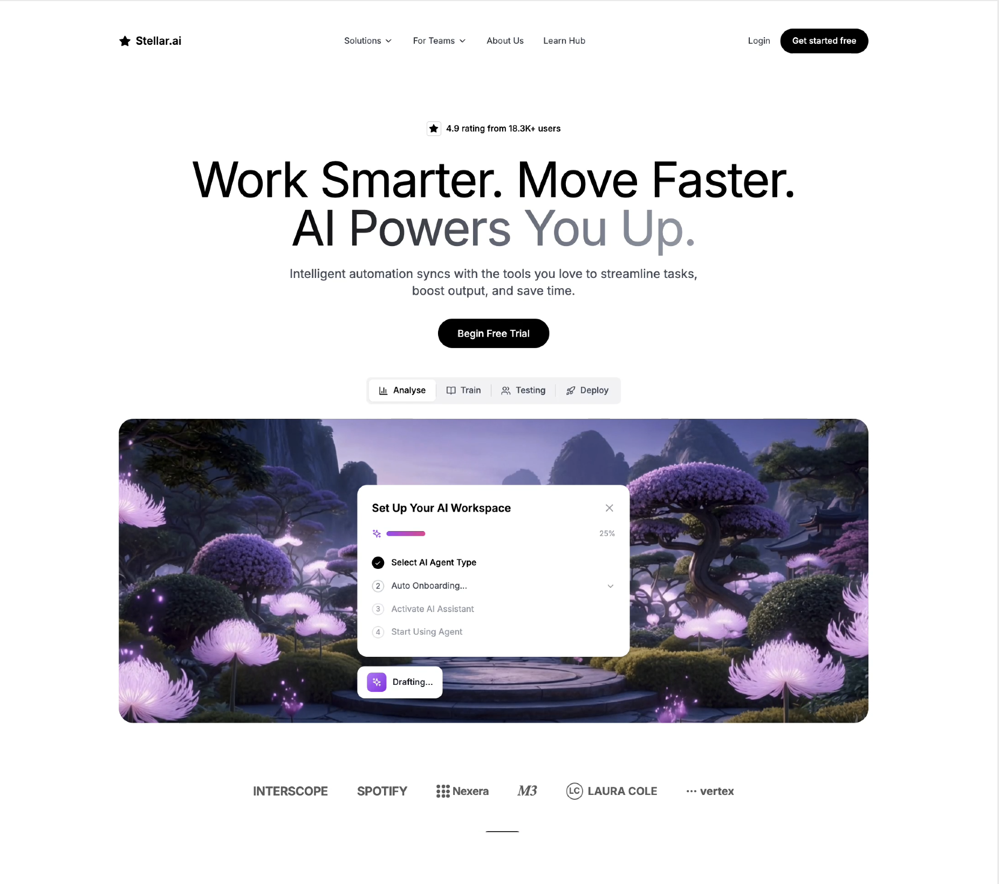
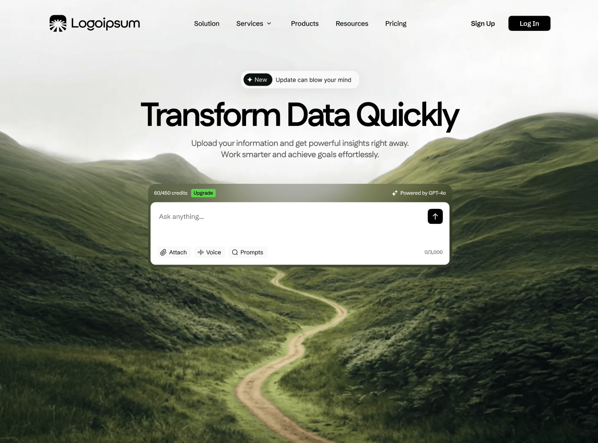
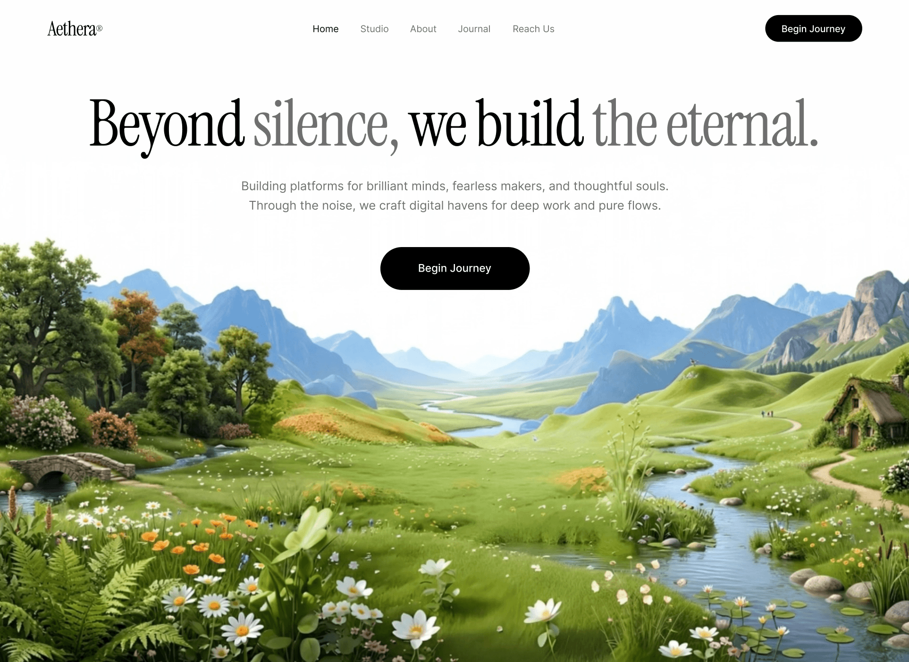
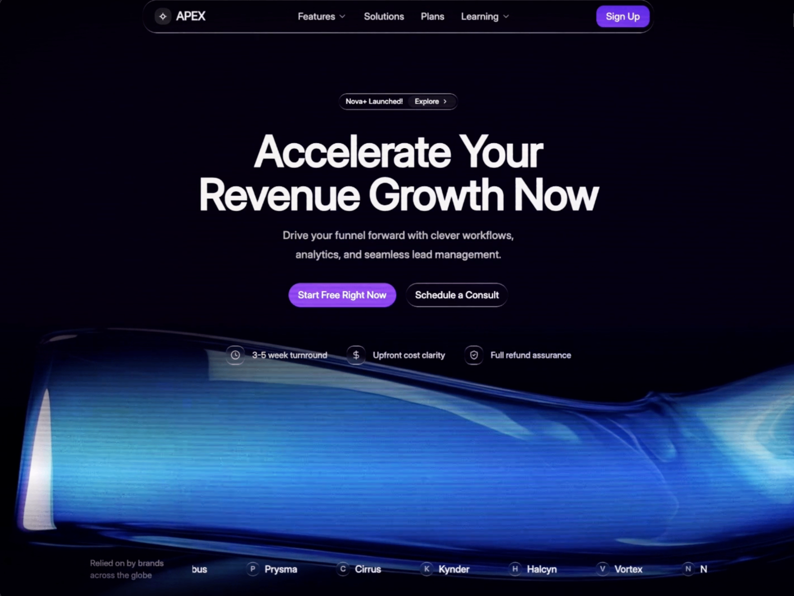
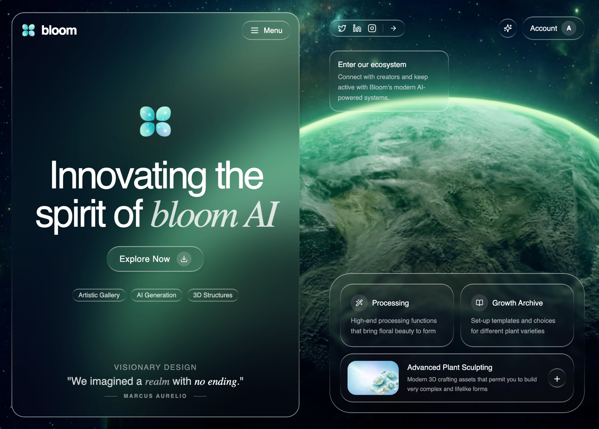

# 🚀 Promptverse - AI Design Prompt Library

<div align="center">



**Mở khóa sức mạnh thiết kế AI đột phá**

Xây dựng landing page đẹp trong vài phút với bộ prompt có sẵn. Copy, tùy chỉnh và triển khai ngay.

[](https://nextjs.org/)
[](https://www.typescriptlang.org/)
[](https://tailwindcss.com/)

[🌐 Live Demo](#) • [📖 Documentation](#features) • [💬 Contact](#contact)

</div>

---

## ✨ Features

### 🎨 **60+ Premium Design Templates**
Bộ sưu tập prompt được thiết kế chuyên nghiệp cho mọi nhu cầu:
- Landing Pages
- Hero Sections
- SaaS Platforms
- Portfolio Sites
- Agency Websites
- E-commerce
- Web3 & NFT
- AI & Tech

### 🤖 **Compatible with 16+ AI Tools**
Prompts hoạt động seamlessly với:

<div align="center">

| Tool | Description |
|------|-------------|
| 🔷 **v0.dev** | Generate UI components instantly |
| ⚡ **Bolt.new** | Full-stack apps with live preview |
| 💖 **Lovable** | Complete landing pages with animations |
| 💻 **Cursor** | AI-powered IDE coding |
| 🌊 **Windsurf** | Advanced code generation |
| 🤖 **Claude** | Production-ready code |
| 🧠 **ChatGPT** | Versatile AI assistant |
| ✨ **Gemini** | Google's powerful AI |
| 💡 **AI Studio** | System instruction optimization |
| 📦 **Replit** | Instant deployment |
| ⚡ **Vercel** | Edge deployment |
| 🎨 **Framer** | Design to code |
| 🌐 **Webflow** | Visual development |
| 🪄 **Dora AI** | No-code AI builder |
| 🔮 **Galileo** | AI design system |
| 🚀 **Uizard** | Rapid prototyping |

</div>

### 🎯 **Key Benefits**
- ✅ **Copy & Paste Ready** - No modifications needed
- ✅ **Production Quality** - Professional, tested designs
- ✅ **Responsive** - Mobile-first approach
- ✅ **Modern Stack** - Latest web technologies
- ✅ **Fast Setup** - Deploy in minutes
- ✅ **Customizable** - Easy to adapt to your brand

---

## 🖼️ Template Showcase

### 🌟 Featured Templates

<table>
  <tr>
    <td width="33%" align="center">
      
      <br/>
      <b>Space Voyage</b>
      <br/>
      <i>Modern space-themed landing page</i>
    </td>
    <td width="33%" align="center">
      
      <br/>
      <b>Velorah - Agency</b>
      <br/>
      <i>Elegant agency website</i>
    </td>
    <td width="33%" align="center">
      
      <br/>
      <b>Grow AI - SaaS Platform</b>
      <br/>
      <i>AI-powered talent platform</i>
    </td>
  </tr>
  <tr>
    <td width="33%" align="center">
      
      <br/>
      <b>Stellar AI</b>
      <br/>
      <i>Dynamic hero with gradients</i>
    </td>
    <td width="33%" align="center">
      
      <br/>
      <b>Transform Data</b>
      <br/>
      <i>Data visualization hero</i>
    </td>
    <td width="33%" align="center">
      
      <br/>
      <b>Aethera</b>
      <br/>
      <i>Futuristic design system</i>
    </td>
  </tr>
  <tr>
    <td width="33%" align="center">
      
      <br/>
      <b>Apex SaaS</b>
      <br/>
      <i>Modern SaaS platform</i>
    </td>
    <td width="33%" align="center">
      
      <br/>
      <b>Bloom AI</b>
      <br/>
      <i>AI-powered solutions</i>
    </td>
    <td width="33%" align="center">
      
      <br/>
      <b>Datacore Booking</b>
      <br/>
      <i>Booking platform design</i>
    </td>
  </tr>
</table>

### 📚 More Templates

<details>
<summary><b>View More Amazing Designs (55+ templates)</b></summary>

#### Portfolio & Creative
- Portfolio Cosmic
- Bold Portfolio Hero
- Dark Portfolio Hero
- xPortfolio Hero
- AI Designer Portfolio

#### SaaS & Tech
- Mindloop Landing
- Datacore Booking
- Apex SaaS
- Neuralyn
- ClearInvoice

#### Agency & Business
- Buzzentic Agency
- Liquid Glass Agency
- Glassmorphism Agency
- Logoisum Video Agency

#### E-commerce & Fintech
- E-commerce Website
- Wealth Video Hero
- Nickel Payments

#### Web3 & NFT
- Orbis NFT
- Orbit Web3
- Web3 EOS Hero

#### AI & Innovation
- NeoVision
- Bloom AI
- Power AI
- Stellar AI
- Dora AI

...and many more!

</details>

---

## 🚀 Quick Start

### Prerequisites
- Node.js 18+ 
- npm or yarn

### Installation

```bash
# Clone the repository
git clone https://github.com/yourusername/promptverse.git

# Navigate to project directory
cd promptverse

# Install dependencies
npm install

# Run development server
npm run dev
```

Open [http://localhost:3000](http://localhost:3000) to view the app.

### Build for Production

```bash
# Create optimized production build
npm run build

# Start production server
npm start
```

---

## 📖 How to Use

### 1️⃣ **Browse Templates**
Explore our curated collection of 60+ design templates organized by category.

### 2️⃣ **Copy Prompt**
Click the "Copy" button on any unlocked template to copy the prompt to your clipboard.

### 3️⃣ **Paste in AI Tool**
Open your favorite AI tool (v0, Bolt, Cursor, Claude, etc.) and paste the prompt.

### 4️⃣ **Generate & Customize**
Let AI generate the code, then customize colors, content, and branding to match your needs.

### 5️⃣ **Deploy**
Deploy your beautiful landing page to Vercel, Netlify, or any hosting platform.

---

## 🛠️ Tech Stack

- **Framework:** [Next.js 15](https://nextjs.org/) - React framework with App Router
- **Language:** [TypeScript](https://www.typescriptlang.org/) - Type-safe development
- **Styling:** [Tailwind CSS 4](https://tailwindcss.com/) - Utility-first CSS
- **Icons:** [Lucide React](https://lucide.dev/) - Beautiful icon library
- **Fonts:** [Google Fonts](https://fonts.google.com/) - Inter, Sora, Instrument Serif
- **Deployment:** [Vercel](https://vercel.com/) - Optimized for Next.js

---

## 📁 Project Structure

```
promptverse/
├── app/                      # Next.js App Router
│   ├── api/                 # API routes
│   │   └── prompts/        # Prompt endpoints
│   ├── instructions/       # Instructions page
│   ├── layout.tsx          # Root layout
│   ├── page.tsx            # Home page
│   └── globals.css         # Global styles
├── components/              # React components
│   ├── copy-prompt-button.tsx
│   └── unlock-contact-modal.tsx
├── lib/                     # Utilities & data
│   ├── home-data.ts        # Template data
│   └── prompt-store.ts     # Prompt storage
├── public/                  # Static assets
│   └── assets/             # Images, fonts, etc.
└── package.json            # Dependencies
```

---

## 🎨 Customization

### Adding New Templates

Edit `lib/home-data.ts`:

```typescript
{
  "kind": "template",
  "title": "Your Template Name",
  "category": "Landing Page",
  "rowSpan2": false,
  "hasLoader": false,
  "action": "copy", // or "premium"
  "boltHref": "",
  "media": [
    {
      "src": "/assets/images/your-preview.gif",
      "alt": "Your Template Name",
      "isPreview": false
    }
  ]
}
```

### Customizing Colors

Update `app/globals.css`:

```css
:root {
  --background: #0a0a0a;
  --foreground: #ededed;
}
```

### Adding New AI Tools

Edit `app/instructions/page.tsx` to add more supported tools with icons.

---

## 🌟 Premium Features

Unlock all 60+ premium templates and get:

- ✨ **Full Prompt Library** - Access to all design templates
- 🎯 **Advanced Prompts** - Optimized for specific AI tools
- 🔄 **Regular Updates** - New templates added monthly
- 💬 **Priority Support** - Direct assistance via Zalo/Facebook
- 📚 **Documentation** - Detailed guides and best practices
- 🎨 **Custom Requests** - Request specific design styles

---

## 📞 Contact

<div align="center">

### 👨‍💻 Trịnh Văn Hào

**Thiết kế bởi Trịnh Văn Hào**

[](https://www.facebook.com/trinhhao142.hayyier/)
[](https://zalo.me/0777228660)
[](mailto:haotrinh142@gmail.com)

📱 **Phone:** 0777228660  
📧 **Email:** haotrinh142@gmail.com  
🌐 **Facebook:** [facebook.com/trinhhao142.hayyier](https://www.facebook.com/trinhhao142.hayyier/)

</div>

---

## 📝 License

This project is created and maintained by **Trịnh Văn Hào**.

For commercial use or custom projects, please [contact me](#contact).

---

## 🙏 Acknowledgments

- Design inspiration from modern web trends
- Built with love using Next.js and Tailwind CSS
- Icons by [Lucide](https://lucide.dev/)
- Fonts from [Google Fonts](https://fonts.google.com/)

---

<div align="center">

**Made with ❤️ by Trịnh Văn Hào**

⭐ Star this repo if you find it helpful!

[Back to Top ↑](#-promptverse---ai-design-prompt-library)

</div>
